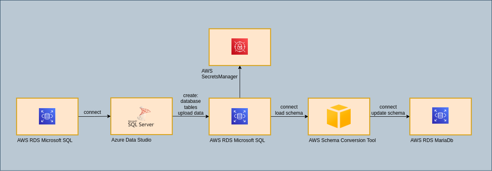
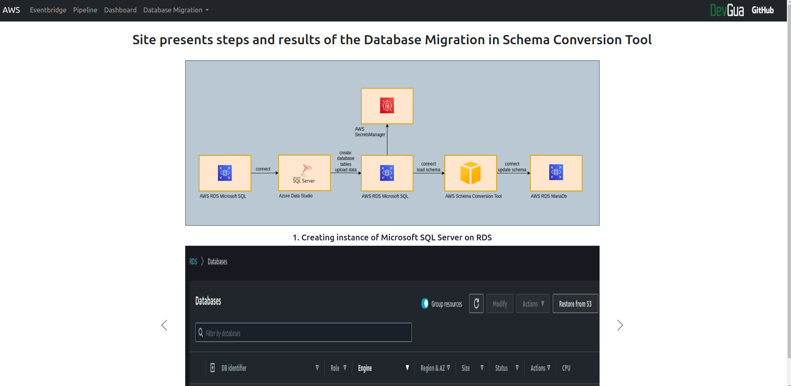

# AWS MIGRATE DATABASE FROM MICROSOFT SQL SERVER TO MARIADB SERVER
> This project show database migration.
> Live demo [_here_](http://mateuszgua.pythonanywhere.com/).

## Table of Contents
* [General Info](#general-information)
* [Technologies Used](#technologies-used)
* [Features](#features)
* [Screenshots](#screenshots)
* [Project Status](#project-status)
* [Contact](#contact)

## General Information
- This project was created because I wanted create database migration in aws services.

## Technologies Used
- Python - version 3.10.6

## Features
List the ready features here:
- Creating diagram with functions,
- Creating databases in RDS services,
- Creating secrets with databases informations,
- Creating connection with database instance and azure data studio,
- Creating database and tables in azuro studio,
- Updating database with data,
- Creating project in schema conversion tool,
- Adding source as database instance microsoft sql server,
- Adding target as database instance mariadb server,
- Creating mapping with databases,
- Converting schema and updating changes on mariadb instance.

## Screenshots
Schematic diagram

Page with project workflow

## Project Status
Project is: completed

## Contact
Created by [@DevGua]() - feel free to contact me!
